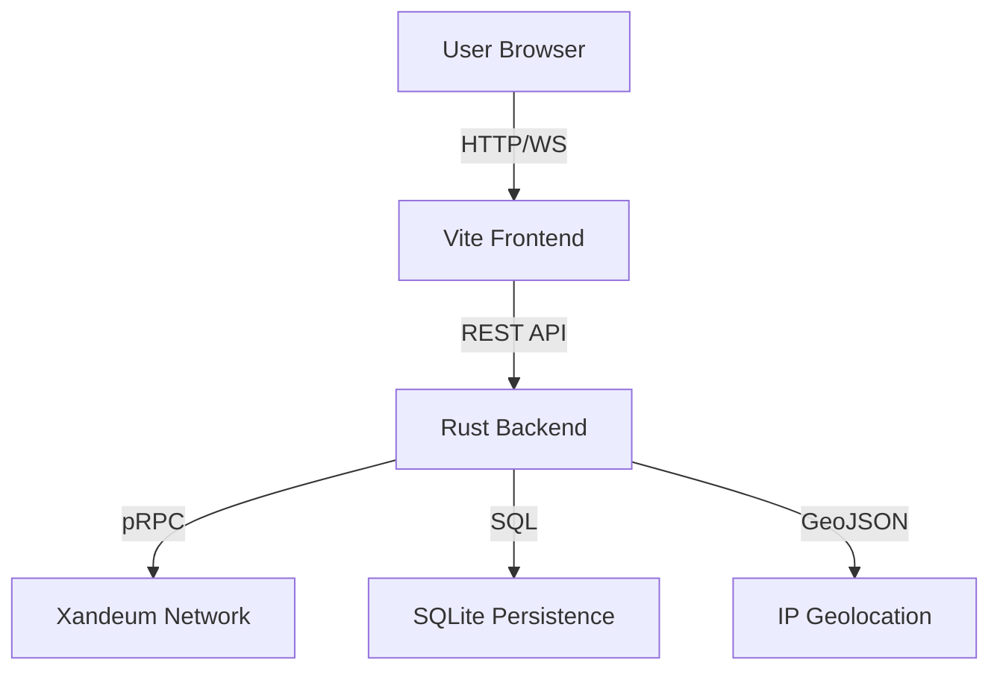

# 🌌 Xandeum Network Observer

**The definitive real-time analytics engine for Xandeum's exabyte-scale storage layer.**

[](https://xandeum-observer.vercel.app)
[](https://xandeum-observer-ophq.onrender.com/pods)
[](LICENSE)

Xandeum Network Observer is a high-performance monitoring platform designed to provide deep, actionable insights into the Xandeum pNode network. Built for speed, clarity, and scalability, it empowers developers and node operators to visualize the pulse of the decentralized storage revolution.

---

## 🚀 Overview

Xandeum is building a scalable storage layer for Solana dApps, functioning as a second tier of Solana accounts that can grow to exabytes. This platform serves as the **mission control** for this network, providing real-time visibility into pNode health, storage commitment, and economic performance.

### 🎯 Use Cases
- **Node Operators**: Monitor SLA compliance, track uptime, and forecast STOINC rewards.
- **Developers**: Verify network decentralization and storage availability for dApps.
- **Ecosystem Stakeholders**: Visualize network growth and regional distribution of storage providers.

---

## ✨ Key Innovations

### 🌍 3D Geospatial Intelligence
Visualize the global footprint of Xandeum. Our interactive 3D globe maps pNodes to their physical locations, providing a clear view of network decentralization and density.

### 📡 Live Gossip Monitor (Terminal Mode)
Experience the network's heartbeat. Our custom gossip listener tracks node discoveries, status changes, and storage events in a high-fidelity terminal interface, powered by real-time pRPC polling.

### 🔍 Node Inspector & SLA Verification
Deep-dive into any pNode with our comprehensive inspector:
- **SLA Report Card**: Real-time verification against network reliability targets (99.9% uptime, <200ms latency).
- **Reward Forecast**: Advanced economic modeling to estimate daily, weekly, and monthly STOINC earnings.
- **Achievement System**: Visual badges for "Uptime Kings," "Latency Legends," and "Storage Giants."

### ⌨️ Command Palette (⌘K)
Navigate the network at light speed. Instant search for nodes by IP, ID, or location, making troubleshooting and analysis effortless.

---

## 🛠️ High-Performance Architecture

Our stack is engineered for sub-millisecond responsiveness and 100% data accuracy.

- **Frontend**: React 18, TypeScript, Vite, TailwindCSS, Framer Motion, Recharts, Three.js.
- **Backend**: Rust (Axum, Tokio) for high-concurrency pRPC data aggregation and middleware logic.
- **Database**: SQLite with SQLx for persistent historical performance tracking and indexed lookups.
- **Data Flow**: Direct integration with Xandeum's pRPC protocol via randomized seed node selection.



---

## 🚀 Getting Started

### 🐳 The Pro Way (Docker Compose)
The entire stack (Frontend + Backend + Database) can be launched with a single command:
```bash
docker-compose up --build
```
The app will be available at `http://localhost:8080`.

### 🛠️ Manual Setup

#### Prerequisites
- Node.js 18+
- Rust (latest stable)

#### 1. Backend (Rust)
```bash
cd server-rust
cargo run --release
```

#### 2. Frontend (React)
```bash
npm install
npm run dev
```

---

## 🏆 Why Xandeum Observer?

Unlike basic dashboards, the Xandeum Observer focuses on **Clarity** and **Innovation**:
- **Zero Mock Data**: Every metric is pulled directly from the pRPC gossip network.
- **Optimized Scalability**: Backend indexed lookups ensure performance even as the network grows to thousands of nodes.
- **Deep Space Aesthetics**: A premium theme designed for professional monitoring environments.

---

Built with ❤️ for the Xandeum Hackathon.
