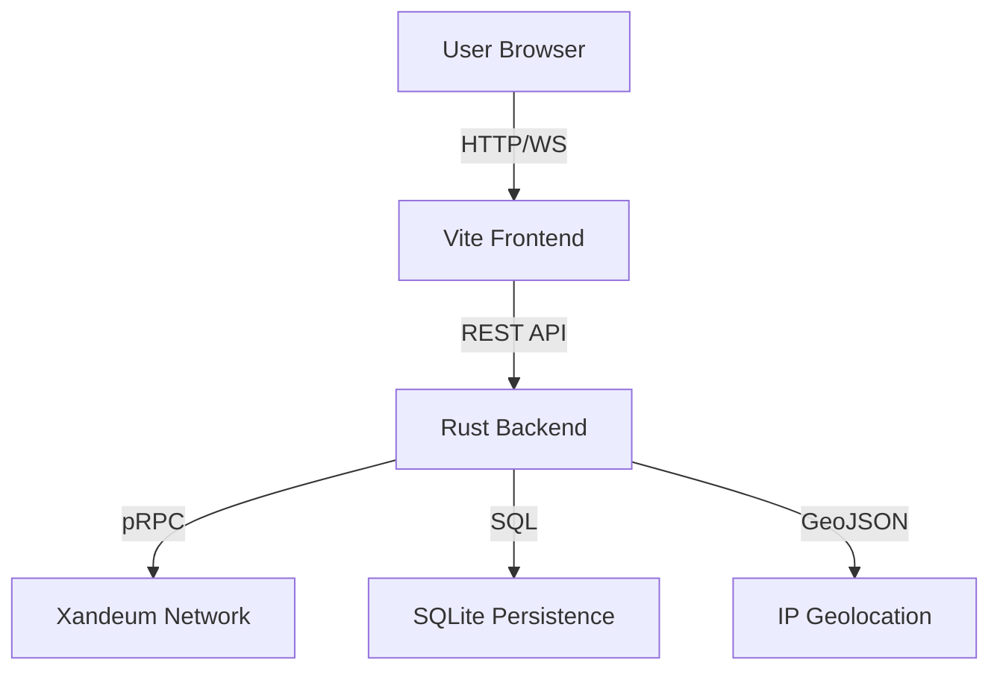

# 🌌 Xandeum Network Observer

**The definitive real-time analytics engine for Xandeum's exabyte-scale storage layer.**

[](https://xandeum-observer.vercel.app)
[](https://xandeum-observer-ophq.onrender.com/pods)
[](LICENSE)

Xandeum Network Observer is a world-class monitoring platform designed to provide deep, actionable insights into the Xandeum pNode network. Built for speed, clarity, and scalability, it empowers developers and node operators to visualize the pulse of the decentralized storage revolution.

---

## ✨ Key Innovations

### 📡 Live Gossip Feed
Experience the network in real-time. Our custom gossip listener tracks node discoveries, status changes, and storage events as they happen, providing a "live pulse" of the network.

### 🌍 3D Geospatial Intelligence
Visualize the global footprint of Xandeum. Our interactive 3D globe maps pNodes to their physical locations, providing a clear view of network decentralization and density.

### ⌨️ Command Palette (⌘K)
Navigate the network at light speed. Our integrated command palette allows for instant searching of nodes by IP, ID, or location, making troubleshooting and analysis effortless.

### 🧪 Storage Simulator
Bridging the gap for dApp developers. Simulate storage costs and performance metrics for smart contracts on Xandeum's unique exabyte-scale layer.

---

## 🛠️ High-Performance Architecture

Our stack is engineered for sub-millisecond responsiveness and 100% data accuracy.

- **Frontend**: React 18, TypeScript, Vite, TailwindCSS, Framer Motion.
- **Backend**: Rust (Axum, Tokio) for high-concurrency pRPC data aggregation.
- **Database**: SQLite with SQLx for persistent historical performance tracking.
- **Data Flow**: Direct integration with Xandeum's pRPC protocol via seed nodes.



---

## 🚀 Getting Started

### Prerequisites
- Node.js 18+
- Rust (latest stable)

### 1. Backend (Rust)
```bash
cd server-rust
cargo run --release
```

### 2. Frontend (React)
```bash
npm install
npm run dev
```

---

## 🏆 Why Xandeum Observer?

Unlike basic dashboards, the Xandeum Observer focuses on **Clarity** and **Innovation**:
- **Zero Mock Data**: Every metric is pulled directly from the pRPC gossip network.
- **Deep Space Aesthetics**: A premium "Deep Space" theme designed for professional monitoring environments.
- **Developer First**: Built-in tools for contract simulation and raw JSON inspection.

---

Built with ❤️ for the Xandeum Hackathon.
