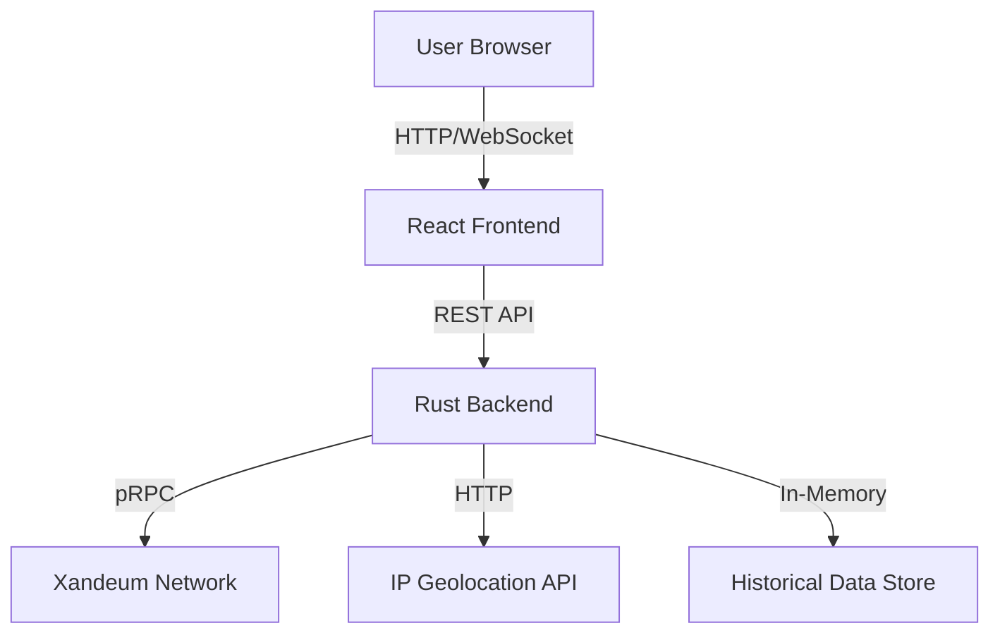

# Xandeum Network Observer

A world-class, real-time analytics platform for the Xandeum storage network. This dashboard provides deep insights into pNode performance, network health, and geographic distribution.


## 🚀 Features

*   **Real-Time Monitoring**: Live updates every 10 seconds via pRPC.
*   **Geospatial Visualization**: Interactive 3D Globe showing physical node distribution.
*   **Historical Analytics**: 24-hour history of network growth and storage capacity.
*   **Advanced Metrics**: Latency, Uptime, and Health Scores for every node.
*   **Contract EDA**: Exploratory Data Analysis for smart contracts (Coming Soon).
*   **Data Export**: Download node data as CSV or JSON.
*   **Premium UI**: "Milk" theme with glassmorphism and responsive design.

## 🛠️ Tech Stack

*   **Frontend**: React, TypeScript, Vite, TailwindCSS, Shadcn/UI, Recharts, React Globe GL.
*   **Backend**: Rust (Axum, Tokio), In-Memory History, IP Geolocation.
*   **Communication**: pRPC (Xandeum's custom RPC protocol).

## ⚡ Quick Start

### Prerequisites
*   Node.js 18+
*   Rust (latest stable)

### 1. Backend (Rust)
The backend handles pRPC connections, geolocation, and historical data aggregation.

```bash
cd server-rust
cargo run --release
```
*Server runs on port 3001.*

### 2. Frontend (React)
The frontend connects to the Rust backend for data.

```bash
# Install dependencies
npm install

# Start development server
npm run dev
```
*Frontend runs on port 8080.*

## 🌍 Deployment

### Backend (Render Web Service)
1.  Create a **Web Service** on Render.
2.  Connect your repo.
3.  **Runtime**: Rust.
4.  **Root Directory**: `server-rust`.
5.  **Build Command**: `cargo build --release`.
6.  **Start Command**: `cargo run --release`.

### Frontend (Vercel/Render Static Site)
1.  Create a **Static Site**.
2.  **Build Command**: `npm run build`.
3.  **Publish Directory**: `dist`.
4.  **Environment Variables**:
    *   `VITE_API_URL`: URL of your deployed Rust backend (e.g., `https://your-rust-app.onrender.com`).

## 📊 Architecture



## 🏆 Hackathon Notes
*   **Real Data Only**: No mock data is used. All stats come directly from the Xandeum network.
*   **Performance**: Rust backend ensures sub-millisecond response times for cached data.
*   **Design**: Focused on "World Class" aesthetics with a clean, professional look.

---
Built with ❤️ for the Xandeum Hackathon.
