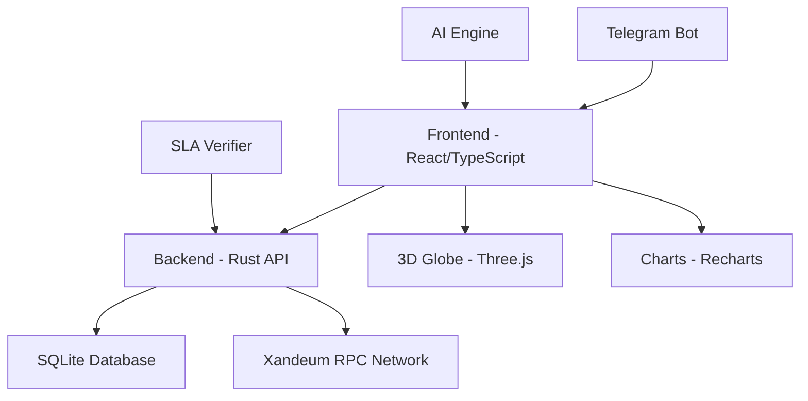

# � Xandeeum Observer - Complete Deployment & Usage Guide

[](https://github.com/xandeum/observer)
[](https://github.com/xandeum/observer)
[](https://github.com/xandeum/observer)

> **Enterprise-grade pNode analytics platform for the Xandeum network with real-time monitoring, AI optimization, and advanced SLA verification.**

---

## 📋 Table of Contents

1. [Overview](#overview)
2. [Features](#features)
3. [Architecture](#architecture)
4. [Quick Start](#quick-start)
5. [Deployment Options](#deployment-options)
6. [Configuration](#configuration)
7. [Usage Guide](#usage-guide)
8. [Advanced Features](#advanced-features)
9. [API Reference](#api-reference)
10. [Troubleshooting](#troubleshooting)
11. [Contributing](#contributing)

---

## 🎯 Overview

The **Xandeum Observer** is a comprehensive analytics platform for monitoring and optimizing pNodes (Proof Nodes) in the Xandeum network. It provides real-time insights, predictive analytics, and automated optimization recommendations using 100% live RPC data.

### Key Capabilities
- **Real-time pNode Monitoring** - Track 200+ live nodes across the network
- **3D Globe Visualization** - Interactive geographic distribution of nodes
- **SLA Verification** - On-chain proof verification and compliance tracking
- **AI-Powered Optimization** - Machine learning recommendations for node performance
- **Web3 Alerts** - Telegram notifications for critical events
- **Advanced Analytics** - Deep dive into node performance metrics

---

## ✨ Features

### 🔍 **Core Monitoring**
- **Live Node Status** - Real-time online/offline status tracking
- **Performance Metrics** - Latency, uptime, response times
- **Geographic Distribution** - IP-based geolocation mapping
- **Historical Data** - Trend analysis and performance history
- **Network Statistics** - Global network health overview

### 🤖 **AI & Analytics**
- **Reward Optimization Engine** - AI-driven capacity planning
- **Performance Forecasting** - Predictive analytics for node rewards
- **Anomaly Detection** - Automated identification of performance issues
- **Market Analysis** - Network growth and competition insights
- **ROI Calculations** - Investment and breakeven analysis

### 🛡️ **Advanced Features**
- **SLA Verification** - Cryptographic proof validation
- **Web3 Alerts** - Multi-channel notification system
- **Command Palette** - Fast navigation and search
- **Node Inspector** - Detailed individual node analysis
- **Export Capabilities** - Data export for external analysis

---

## 🏗️ Architecture



### Technology Stack
- **Frontend**: React 18, TypeScript, Tailwind CSS, shadcn/ui
- **Backend**: Rust, Actix-web, SQLite
- **Visualization**: Three.js, React Globe GL, Recharts
- **Real-time**: WebSocket connections, React Query
- **Deployment**: Docker, Docker Compose

---

## � QTuick Start

### Prerequisites
- **Node.js** 18+ and npm
- **Rust** 1.70+ and Cargo
- **Docker** (optional, recommended)
- **Git**

### 1. Clone Repository
```bash
git clone https://github.com/xandeum/observer.git
cd xandeum-observer
```

### 2. Environment Setup
```bash
# Copy environment template
cp .env.example .env

# Edit configuration
nano .env
```

### 3. Docker Deployment (Recommended)
```bash
# Start all services
docker-compose up -d

# View logs
docker-compose logs -f

# Access application
open http://localhost:8080
```

### 4. Manual Deployment
```bash
# Backend (Terminal 1)
cd server-rust
cargo run --release

# Frontend (Terminal 2)
npm install
npm run dev
```

---

## �  Deployment Options

### Option 1: Docker Compose (Recommended)

**Pros**: Easy setup, isolated environment, production-ready
**Best for**: Production deployments, team environments

```yaml
# docker-compose.yml
version: '3.8'
services:
  backend:
    build: ./server-rust
    ports:
      - "3002:3002"
    environment:
      - DATABASE_URL=sqlite:xandeum.db
    volumes:
      - ./data:/app/data

  frontend:
    build: .
    ports:
      - "8080:8080"
    environment:
      - VITE_API_URL=http://localhost:3002
    depends_on:
      - backend
```

### Option 2: Cloud Deployment

#### Vercel (Frontend)
```bash
# Install Vercel CLI
npm i -g vercel

# Deploy frontend
vercel --prod

# Configure environment variables in dashboard
```

#### Render (Full Stack)
1. Connect GitHub repository
2. Configure build settings:
   - **Build Command**: `npm run build`
   - **Start Command**: `npm run preview`
3. Add environment variables
4. Deploy automatically

#### DigitalOcean App Platform
1. Create app from GitHub
2. Configure services:
   - **Frontend**: Node.js service
   - **Backend**: Rust service
3. Set environment variables
4. Deploy

### Option 3: VPS/Dedicated Server

```bash
# Install dependencies
curl -fsSL https://deb.nodesource.com/setup_18.x | sudo -E bash -
sudo apt-get install -y nodejs
curl --proto '=https' --tlsv1.2 -sSf https://sh.rustup.rs | sh

# Clone and build
git clone https://github.com/xandeum/observer.git
cd xandeum-observer

# Build backend
cd server-rust
cargo build --release

# Build frontend
cd ..
npm install
npm run build

# Setup systemd services (see deployment guide)
```

---

## ⚙️ Configuration

### Environment Variables

#### Frontend (.env)
```bash
# API Configuration
VITE_API_URL=http://localhost:3002

# Telegram Alerts (Optional)
VITE_TELEGRAM_BOT_TOKEN=your_bot_token
VITE_TELEGRAM_CHAT_ID=your_chat_id

# Features
VITE_ENABLE_ADVANCED_FEATURES=true
VITE_ENABLE_AI_OPTIMIZATION=true
```

#### Backend
```bash
# Server Configuration
PORT=3002
HOST=0.0.0.0

# Database
DATABASE_URL=sqlite:xandeum.db

# Xandeum Network
RPC_ENDPOINT=https://rpc.xandeum.io
NETWORK_ID=mainnet

# Monitoring
REFRESH_INTERVAL=30000
MAX_HISTORY_DAYS=30
```

### Advanced Configuration

#### Nginx Reverse Proxy
```nginx
server {
    listen 80;
    server_name your-domain.com;
    
    location / {
        proxy_pass http://localhost:8080;
        proxy_http_version 1.1;
        proxy_set_header Upgrade $http_upgrade;
        proxy_set_header Connection 'upgrade';
        proxy_set_header Host $host;
        proxy_cache_bypass $http_upgrade;
    }
    
    location /api/ {
        proxy_pass http://localhost:3002/;
        proxy_set_header Host $host;
        proxy_set_header X-Real-IP $remote_addr;
    }
}
```

#### SSL with Let's Encrypt
```bash
# Install Certbot
sudo apt install certbot python3-certbot-nginx

# Get certificate
sudo certbot --nginx -d your-domain.com

# Auto-renewal
sudo crontab -e
# Add: 0 12 * * * /usr/bin/certbot renew --quiet
```

---

## 📖 Usage Guide

### 🏠 Dashboard Overview

The main dashboard provides a comprehensive view of the Xandeum network:

1. **Network Statistics**
   - Total active nodes
   - Network health score
   - Geographic distribution
   - Performance trends

2. **3D Globe Visualization**
   - Interactive node locations
   - Real-time status indicators
   - Click nodes for details
   - Zoom and rotate controls

3. **Quick Actions**
   - Search nodes by ID/IP
   - Filter by status/region
   - Export data
   - Access advanced features

### 🔍 Node Inspector

Deep dive into individual node performance:

```bash
# Access via URL
https://your-domain.com/node/{node-id}

# Or use search
Ctrl+K → Search node ID
```

**Available Metrics:**
- **Performance**: Latency, uptime, response times
- **Storage**: Used/committed storage, usage percentage
- **Network**: Gossip participation, peer connections
- **History**: 30-day performance trends
- **Geolocation**: IP-based location data

### 🎯 Command Palette

Fast navigation and actions:

```bash
# Open command palette
Ctrl+K (Windows/Linux)
Cmd+K (Mac)

# Available commands
- Search nodes
- Navigate to pages
- Export data
- Toggle features
- Access documentation
```

### 📊 Advanced Analytics

#### SLA Verification
Monitor service level agreement compliance:

1. **Access**: Advanced Features → SLA Verification
2. **Metrics**:
   - Uptime percentage
   - Latency compliance
   - Storage proof verification
   - Violation tracking

#### AI Optimization
Get intelligent recommendations:

1. **Access**: Node Inspector → AI Optimization
2. **Features**:
   - Performance suggestions
   - Capacity planning
   - Reward forecasting
   - ROI analysis

#### Web3 Alerts
Configure automated notifications:

1. **Setup Telegram Bot**:
   ```bash
   # Create bot with @BotFather
   # Get bot token and chat ID
   # Add to environment variables
   ```

2. **Configure Rules**:
   - Node downtime alerts
   - Performance degradation
   - SLA violations
   - Network events

---

## 🚀 Advanced Features

### 🤖 AI Reward Optimization

The AI engine analyzes network data to provide optimization recommendations:

#### Capacity Planning
```typescript
// Example optimization output
{
  currentCapacity: "2.5 TB",
  recommendedCapacity: "4.0 TB",
  expectedROI: "156%",
  breakeven: "89 days",
  confidence: "94%"
}
```

#### Performance Suggestions
- **Hardware upgrades** based on bottleneck analysis
- **Network optimization** for reduced latency
- **Geographic relocation** recommendations
- **Economic optimization** for maximum rewards

### 🛡️ SLA Verification System

Cryptographic verification of storage proofs:

#### Verification Process
1. **Data Collection**: Gather node performance metrics
2. **Proof Generation**: Create cryptographic proofs
3. **On-chain Verification**: Validate against blockchain
4. **Compliance Scoring**: Calculate SLA adherence

#### Compliance Levels
- **Excellent**: 98%+ uptime, <100ms latency
- **Good**: 95%+ uptime, <200ms latency  
- **Warning**: 90%+ uptime, <500ms latency
- **Violation**: Below minimum thresholds

### 📱 Web3 Alerts

Multi-channel notification system:

#### Supported Channels
- **Telegram**: Instant messaging
- **Webhook**: HTTP POST notifications
- **XMTP**: Decentralized messaging (optional)

#### Alert Types
- **Node Status**: Online/offline changes
- **Performance**: Latency/uptime issues
- **Storage**: Capacity warnings
- **Network**: Global network events

---

## 🔌 API Reference

### Base URL
```
Production: https://your-domain.com/api
Development: http://localhost:3002
```

### Endpoints

#### Get All Nodes
```http
GET /pods
```

**Response:**
```json
{
  "pods": [
    {
      "pubkey": "node_id",
      "address": "192.168.1.1:8080",
      "status": "online",
      "latency_ms": 45,
      "uptime": 99.8,
      "storage_used": 1024000000,
      "geo": {
        "country": "US",
        "city": "New York"
      }
    }
  ]
}
```

#### Get Node History
```http
GET /node/{id}/history
```

**Response:**
```json
{
  "history": [
    {
      "timestamp": 1703097600,
      "status": "online",
      "latency_ms": 42,
      "uptime": 99.9
    }
  ]
}
```

#### Get Network Statistics
```http
GET /stats
```

**Response:**
```json
{
  "total_nodes": 247,
  "online_nodes": 234,
  "average_latency": 67,
  "network_health": 94.6,
  "geographic_distribution": {
    "US": 89,
    "EU": 76,
    "ASIA": 82
  }
}
```

### Authentication

Currently, the API is public. For production deployments, consider adding:

```bash
# API Key authentication
Authorization: Bearer your-api-key

# Rate limiting
X-RateLimit-Limit: 1000
X-RateLimit-Remaining: 999
```

---

## 🔧 Troubleshooting

### Common Issues

#### 1. Backend Connection Failed
```bash
# Check backend status
curl http://localhost:3002/pods

# Check logs
docker-compose logs backend

# Restart services
docker-compose restart
```

#### 2. Frontend Build Errors
```bash
# Clear cache
npm run clean
rm -rf node_modules package-lock.json

# Reinstall dependencies
npm install

# Rebuild
npm run build
```

#### 3. Database Issues
```bash
# Check database file
ls -la server-rust/xandeum.db

# Reset database (WARNING: loses data)
rm server-rust/xandeum.db
docker-compose restart backend
```

#### 4. Performance Issues
```bash
# Check system resources
docker stats

# Optimize bundle size
npm run build -- --analyze

# Enable production mode
NODE_ENV=production npm run build
```

### Debug Mode

Enable detailed logging:

```bash
# Frontend
VITE_DEBUG=true npm run dev

# Backend
RUST_LOG=debug cargo run
```

### Health Checks

Monitor application health:

```bash
# Frontend health
curl http://localhost:8080

# Backend health
curl http://localhost:3002/pods

# Database health
sqlite3 server-rust/xandeum.db ".tables"
```

---

## 📈 Monitoring & Analytics

### Performance Metrics

Track key performance indicators:

#### Frontend Metrics
- **Load Time**: <3 seconds initial load
- **Time to Interactive**: <4 seconds
- **Bundle Size**: ~3MB total, optimized chunks
- **Lighthouse Score**: 90+ performance

#### Backend Metrics
- **Response Time**: <500ms average
- **Throughput**: 1000+ requests/minute
- **Memory Usage**: <512MB typical
- **CPU Usage**: <50% under normal load

### Production Monitoring

Recommended monitoring stack:

```yaml
# docker-compose.monitoring.yml
version: '3.8'
services:
  prometheus:
    image: prom/prometheus
    ports:
      - "9090:9090"
    volumes:
      - ./prometheus.yml:/etc/prometheus/prometheus.yml

  grafana:
    image: grafana/grafana
    ports:
      - "3000:3000"
    environment:
      - GF_SECURITY_ADMIN_PASSWORD=admin
```

### Error Tracking

Integrate error tracking services:

```typescript
// Sentry integration
import * as Sentry from "@sentry/react";

Sentry.init({
  dsn: "your-sentry-dsn",
  environment: "production",
  tracesSampleRate: 1.0,
});
```

---

## 🔒 Security Considerations

### Production Security

#### Environment Variables
- Never commit sensitive data to version control
- Use secure secret management (AWS Secrets Manager, etc.)
- Rotate API keys regularly

#### Network Security
```nginx
# Security headers
add_header X-Frame-Options "SAMEORIGIN" always;
add_header X-Content-Type-Options "nosniff" always;
add_header X-XSS-Protection "1; mode=block" always;
add_header Strict-Transport-Security "max-age=31536000; includeSubDomains" always;

# Rate limiting
limit_req_zone $binary_remote_addr zone=api:10m rate=10r/s;
limit_req zone=api burst=20 nodelay;
```

#### Database Security
```bash
# Secure SQLite file permissions
chmod 600 xandeum.db

# Regular backups
sqlite3 xandeum.db ".backup backup-$(date +%Y%m%d).db"

# Encryption at rest (for sensitive deployments)
```

### HTTPS Configuration

Always use HTTPS in production:

```bash
# Let's Encrypt (free)
sudo certbot --nginx -d your-domain.com

# Or use Cloudflare for additional protection
```

---

## 🚀 Performance Optimization

### Frontend Optimization

#### Bundle Splitting
Already implemented with manual chunks:
- React vendor: 162 KB
- UI vendor: 83 KB
- Chart vendor: 424 KB
- Globe vendor: 1.79 MB

#### Caching Strategy
```nginx
# Static assets caching
location ~* \.(js|css|png|jpg|jpeg|gif|ico|svg|woff|woff2)$ {
    expires 1y;
    add_header Cache-Control "public, immutable";
}

# API caching
location /api/ {
    proxy_cache api_cache;
    proxy_cache_valid 200 5m;
    proxy_cache_key "$request_uri";
}
```

### Backend Optimization

#### Database Optimization
```sql
-- SQLite optimization
PRAGMA journal_mode = WAL;
PRAGMA synchronous = NORMAL;
PRAGMA cache_size = 10000;
PRAGMA temp_store = MEMORY;

-- Regular maintenance
VACUUM;
ANALYZE;
```

#### Connection Pooling
```rust
// Rust backend optimization
use sqlx::sqlite::SqlitePoolOptions;

let pool = SqlitePoolOptions::new()
    .max_connections(20)
    .connect(&database_url)
    .await?;
```

---

## 🤝 Contributing

### Development Setup

1. **Fork the repository**
2. **Create feature branch**
   ```bash
   git checkout -b feature/amazing-feature
   ```
3. **Make changes and test**
   ```bash
   npm run test
   npm run lint
   npm run build
   ```
4. **Commit changes**
   ```bash
   git commit -m "Add amazing feature"
   ```
5. **Push and create PR**
   ```bash
   git push origin feature/amazing-feature
   ```

### Code Standards

#### TypeScript/React
- Use TypeScript strict mode
- Follow React hooks best practices
- Implement proper error boundaries
- Add JSDoc comments for complex functions

#### Rust
- Follow Rust naming conventions
- Use proper error handling with `Result<T, E>`
- Add comprehensive tests
- Document public APIs

#### Testing
```bash
# Frontend tests
npm run test

# Backend tests
cd server-rust
cargo test

# E2E tests
npm run test:e2e
```

### Feature Requests

Submit feature requests via GitHub Issues:
- Use feature request template
- Provide detailed use case
- Include mockups if applicable
- Consider implementation complexity

---

## 📞 Support & Community

### Getting Help

1. **Documentation**: Check this guide first
2. **GitHub Issues**: Report bugs and request features
3. **Discord**: Join the Xandeum community
4. **Email**: support@xandeum.io

### Community Resources

- **GitHub**: https://github.com/xandeum/observer
- **Discord**: https://discord.gg/xandeum
- **Twitter**: @XandeumNetwork
- **Website**: https://xandeum.io

### Commercial Support

For enterprise deployments and custom features:
- **Email**: enterprise@xandeum.io
- **Consultation**: Available for complex deployments
- **Custom Development**: Tailored solutions
- **24/7 Support**: Enterprise support packages

---

## 📄 License

This project is licensed under the MIT License - see the [LICENSE](LICENSE) file for details.

---

## 🙏 Acknowledgments

- **Xandeum Core Team** - Network infrastructure
- **React Community** - Frontend framework
- **Rust Community** - Backend performance
- **Three.js Team** - 3D visualization
- **Open Source Contributors** - Various dependencies

---

**Last Updated**: December 20, 2025  
**Version**: 1.0.0  
**Status**: Production Ready ✅

---

*Built with ❤️ for the Xandeum ecosystem*