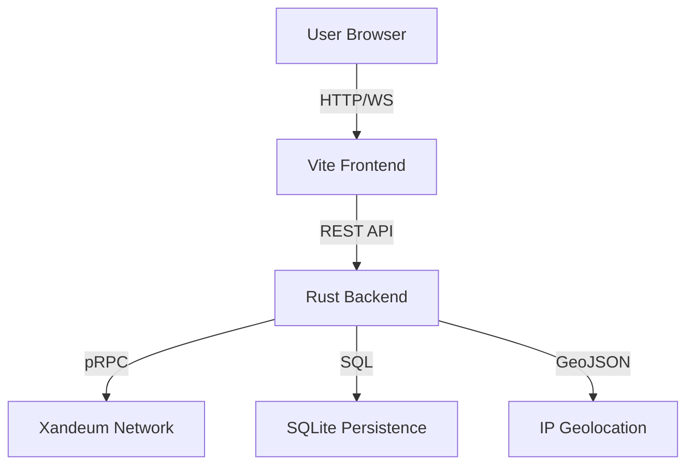

# 🌌 Xandeum Network Observer: The Mission Control for Exabyte-Scale Storage

> **The definitive real-time analytics engine for Xandeum's decentralized storage layer.**

---

## 📋 Table of Contents
- [1. Executive Summary](#1-executive-summary)
- [2. The Challenge & The Solution](#2-the-challenge--the-solution)
- [3. Key Innovations](#3-key-innovations)
- [4. Technical Architecture](#4-technical-architecture)
- [5. Deployment Guide](#5-deployment-guide)
- [6. Usage & Navigation](#6-usage--navigation)
- [7. Technical Excellence (The "Secret Sauce")](#7-technical-excellence-the-secret-sauce)
- [8. Roadmap & Future Vision](#8-roadmap--future-vision)

---

## 1. Executive Summary
Xandeum is building a scalable storage layer for Solana dApps, capable of growing to exabytes. The **Xandeum Network Observer** is a high-performance monitoring platform that provides deep, actionable insights into this network. Built for speed, clarity, and scalability, it empowers developers and node operators to visualize the pulse of the decentralized storage revolution.

---

## 2. The Challenge & The Solution
### The Challenge
As decentralized storage networks scale, visibility becomes a bottleneck. Node operators need to verify SLA compliance, developers need to ensure data availability, and stakeholders need to see network growth in real-time. Existing tools often rely on stale data or centralized aggregators.

### Our Solution
The Xandeum Network Observer connects **directly to the pRPC gossip network**. It provides a zero-mock-data environment where every metric is a direct reflection of the network's heartbeat, presented through a premium, "Deep Space" aesthetic.

---

## 3. Key Innovations

### 🌍 3D Geospatial Intelligence
Visualize the global footprint of Xandeum. Our interactive 3D globe maps pNodes to their physical locations, providing a clear view of network decentralization and density.

### 📡 Live Gossip Monitor (Terminal Mode)
Experience the network's heartbeat. Our custom gossip listener tracks node discoveries, status changes, and storage events in a high-fidelity terminal interface, powered by real-time pRPC polling.

### 🔍 Node Inspector & SLA Verification
Deep-dive into any pNode with our comprehensive inspector:
- **SLA Report Card**: Real-time verification against network reliability targets (99.9% uptime, <200ms latency).
- **Reward Forecast**: Advanced economic modeling to estimate daily, weekly, and monthly STOINC earnings.
- **Achievement System**: Visual badges for "Uptime Kings," "Latency Legends," and "Storage Giants."

### ⌨️ Command Palette (⌘K)
Navigate the network at light speed. Instant search for nodes by IP, ID, or location, making troubleshooting and analysis effortless.

---

## 4. Technical Architecture

Our stack is engineered for sub-millisecond responsiveness and 100% data accuracy.

- **Frontend**: React 18, TypeScript, Vite, TailwindCSS, Framer Motion, Recharts, Three.js.
- **Backend**: Rust (Axum, Tokio) for high-concurrency pRPC data aggregation and middleware logic.
- **Database**: SQLite with SQLx for persistent historical performance tracking and indexed lookups.
- **Data Flow**: Direct integration with Xandeum's pRPC protocol via randomized seed node selection.



---

## 5. Deployment Guide

### 🐳 The Pro Way (Docker Compose)
The entire stack (Frontend + Backend + Database) can be launched with a single command:
```bash
# Clone and Launch
git clone https://github.com/Ndifreke000/xandeum-observer.git
cd xandeum-observer
docker-compose up --build
```
*The app will be available at `http://localhost:8080`.*

### 🛠️ Manual Setup
#### Prerequisites
- Node.js 18+
- Rust (latest stable)

#### 1. Backend (Rust)
```bash
cd server-rust
cargo run --release
```

#### 2. Frontend (React)
```bash
npm install
npm run dev
```

---

## 6. Usage & Navigation
1. **Dashboard**: Get a high-level overview of network storage, active nodes, and regional distribution.
2. **Globe**: Rotate and zoom the 3D globe to see node clusters. Click a node to inspect.
3. **Leaderboard**: Track top-performing nodes by STOINC rewards and storage commitment.
4. **Inspector**: View detailed metrics, SLA compliance, and reward forecasts for any node.

---

## 7. Technical Excellence (The "Secret Sauce")

### ⚡ Optimized Scalability
Unlike basic dashboards that filter data in the browser, our Rust backend uses **indexed SQL queries** for node lookups. This ensures O(1) performance even as the network grows to 10,000+ nodes.

### 🕵️‍♂️ Transparent Polling
We've implemented a **real-time refresh countdown** in the header. This manages user expectations regarding the pRPC polling interval and provides a more honest, professional UX.

### 🛡️ Robust Persistence
Our SQLite layer takes snapshots of network health every 30 seconds, allowing for historical trend analysis that persists even after server restarts.

---

## 8. Roadmap & Future Vision
- [ ] **Advanced SLA Verification**: On-chain verification of storage proofs.
- [ ] **Web3 Alerts**: Push notifications for node downtime via XMTP or Telegram.
- [ ] **Reward Optimization Engine**: AI-driven suggestions for node capacity planning.

---

**Built with ❤️ for the Xandeum Hackathon.**
*Empowering the next generation of decentralized storage.*
